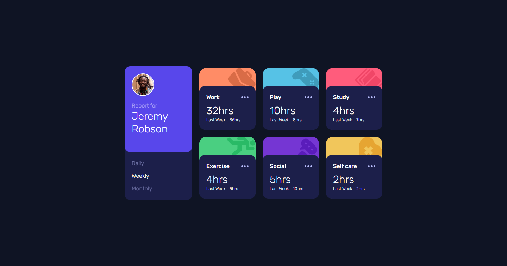

# Frontend Mentor - Time tracking dashboard solution

This is a solution to the [Time tracking dashboard challenge on Frontend Mentor](https://www.frontendmentor.io/challenges/time-tracking-dashboard-UIQ7167Jw). Frontend Mentor challenges help you improve your coding skills by building realistic projects.

## Table of contents

- [Overview](#overview)
  - [The challenge](#the-challenge)
  - [Screenshot](#screenshot)
  - [Links](#links)
- [My process](#my-process)
  - [Built with](#built-with)
  - [What I learned](#what-i-learned)
  - [Continued development](#continued-development)
  - [Useful resources](#useful-resources)
- [Author](#author)
- [Acknowledgments](#acknowledgments)

## Overview

### The challenge

Users should be able to:

- View the optimal layout for the site depending on their device's screen size
- See hover states for all interactive elements on the page
- Switch between viewing Daily, Weekly, and Monthly stats

### Screenshot



### Links

- Solution URL: [github repository](https://github.com/franc1sc0sv/Time_tracking_dashboard.git)
- Live Site URL: [Live Site](https://franc1sc0sv.github.io/Time_tracking_dashboard/public/)

## My process

### Built with

- Semantic HTML5 markup
- CSS custom properties
- Flexbox
- CSS Grid
- Mobile-first workflow
- Utility-First Fundamentals
- Vanilla JS
- [Tailwindcss](https://tailwindcss.com/) - For styles

### What I learned

Use this section to recap over some of your major learnings while working through this project. Writing these out and providing code samples of areas you want to highlight is a great way to reinforce your own knowledge.

To see how you can add code snippets, see below:

```js
function main(id) {
  let container_cards = document.getElementById("container_cards");
  container_cards.innerHTML = ``;
  for (let i = 0; i < 6; i++) {
    let data = getData(id, i);
    container_cards.innerHTML += getCard(data.current, data.previous, id, i);
  }
}
```

If you want more help with writing markdown, we'd recommend checking out [The Markdown Guide](https://www.markdownguide.org/) to learn more.

### Useful resources

- [Tailwind docs](https://tailwindcss.com/docs/installation)

## Author

- Frontend Mentor - [@franc1sc0sv](https://www.frontendmentor.io/profile/franc1sc0sv)
